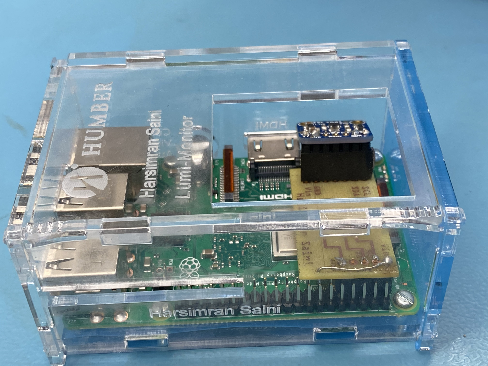
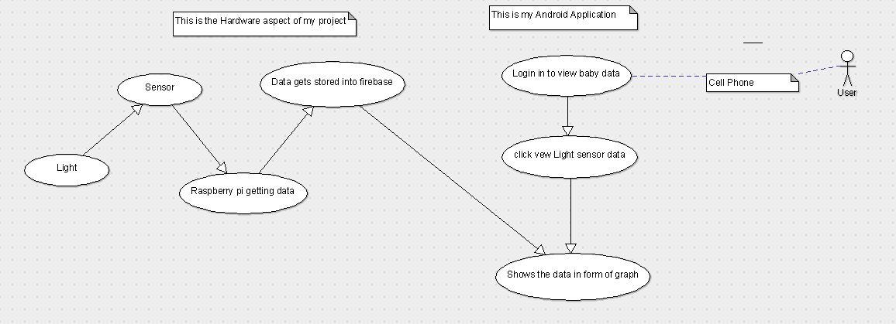
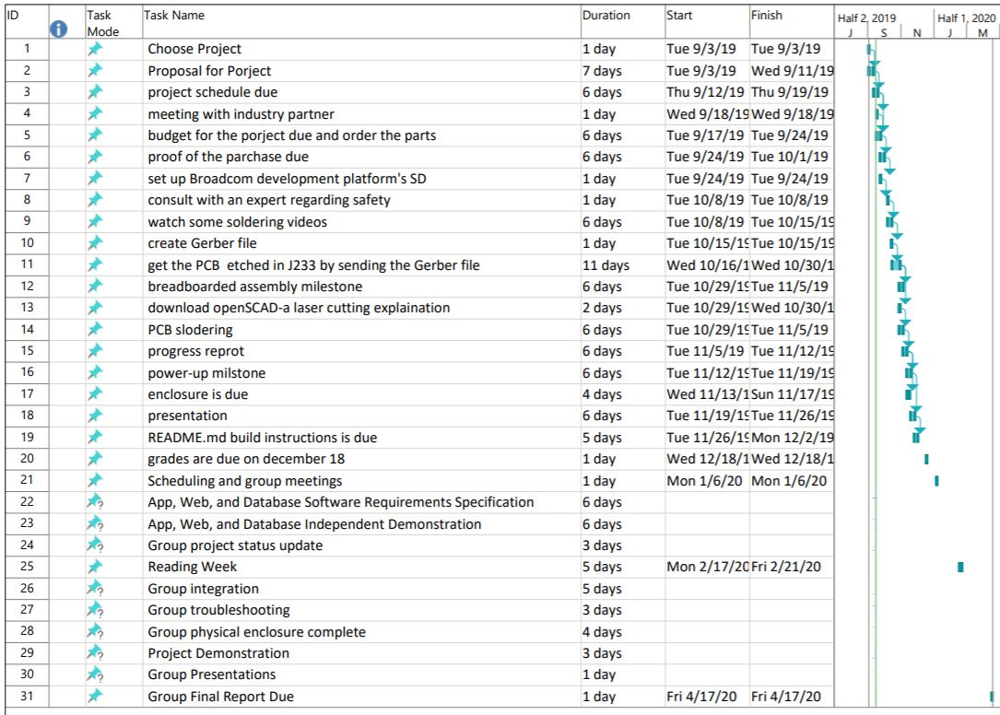
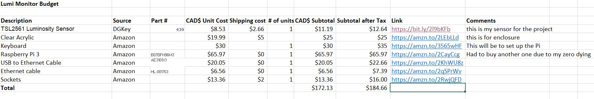
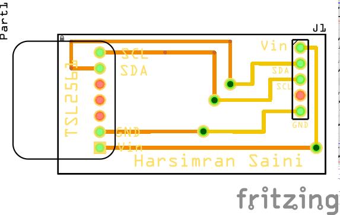
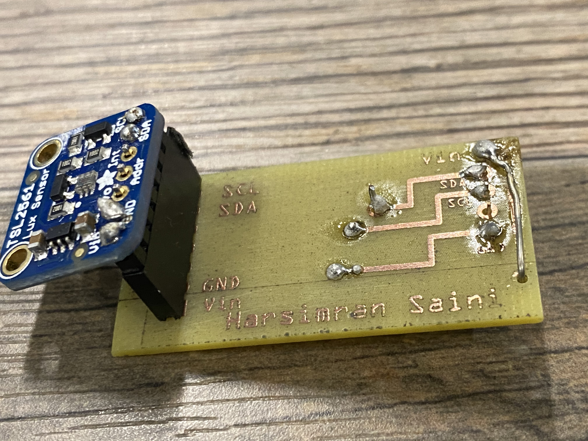
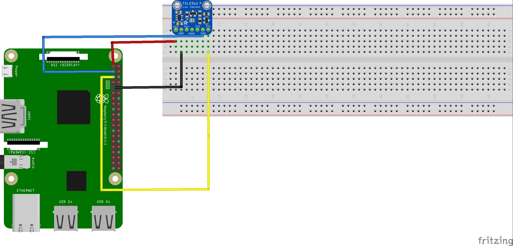
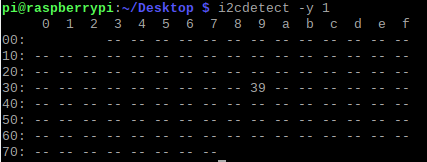
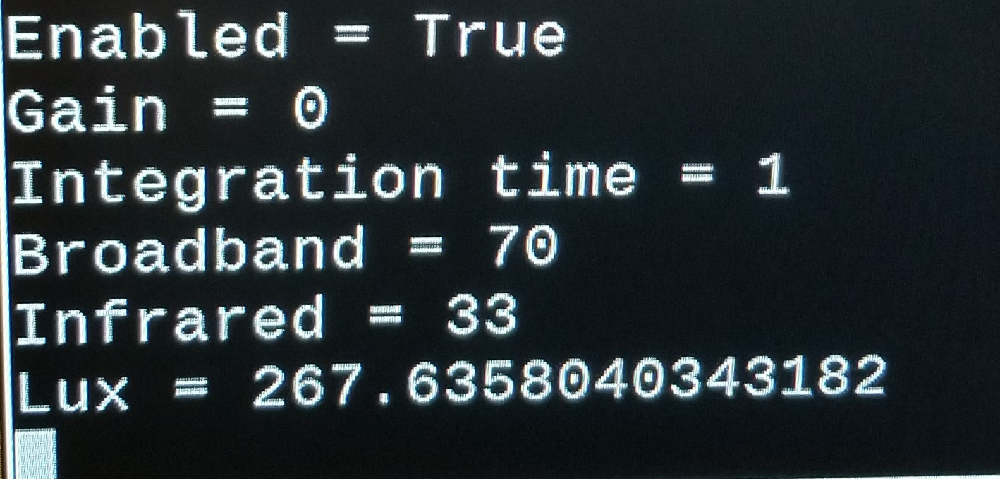
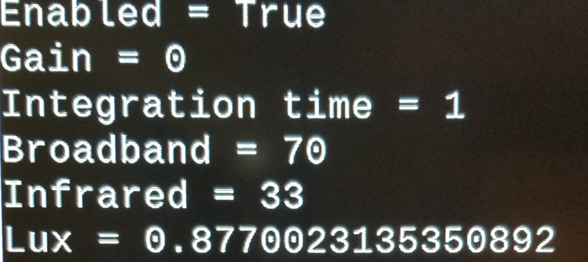

# TSL2561 - Build Instructions 
# Table of Contents 

[Introduction](https://github.com/simransaini1999/Lumi-Monitor#Introduction)

[Schedule](https://github.com/simransaini1999/Lumi-Monitor#Schedule)

[Budget](https://github.com/simransaini1999/Lumi-Monitor#Budget)

[Assembly](https://github.com/simransaini1999/Lumi-Monitor#Assembly)

[PCB & Soldering](https://github.com/simransaini1999/Lumi-Monitor#PCB%20&%20Soldering)

[Power Up](https://github.com/simransaini1999/Lumi-Monitor#Power%20Up)

[Testing](https://github.com/simransaini1999/Lumi-Monitor#Testing)


# Introduction

Welcome to the build instructions of the TSL2561 Lumnosity sensor. In these instructions we will be using a broadcom development platform aka Raspberry Pi and will need a case  at the end to put all the components in.
# System Diagram

# Schedule 

Estimated time to finish this project if this build instruction is followed: 
- Setting up the raspberry pi with OS: 45min - 1hr considering the download speed on your WIFI
- testing sensor with breadboard: 20 minutes  
- PCB soldering: 20 - 30 minutes 
- Laser cutting the case: 20 minutes 
- PCB power up: 10 minutes
- Assebling the case with raspberry pi in it: 10 - 15 minutes
This project should be able to be finished over the weekend considering that you have all the materials ready to connect. 
# Budget

Below here are the links to the materials that will be needed for the project. 

[TSL2561 Luminosity Sensor](https://bit.ly/2l9bKFb)

[Raspberry Pi 3](https://amzn.to/2CayCcg)

[USB to Ethernet Cable](https://amzn.to/2KhWU8z)

[Ethernet cable](https://amzn.to/2qSPrWv)

[Keyboard ](https://amzn.to/3565wHF)

[Clear Acrylic](https://amzn.to/2LEbLLd)

[Sockets](https://amzn.to/2RwjQFD)
# PCB & Soldering 
### PCB Design 
The design for this PCB can be found [here](Electronics/Fritzing/printing_PCB.fzz)

### PCB final Look
This is how your PCB and sensor suppose to look like after it is soldered and ready to mount on the raspberry pi.


# Assembly 
### Set up Raspberry Pi
[How to install the OS on SD card](https://www.youtube.com/watch?v=jsi50bCo_W4) 
### Set up Sensor on breadboard
This is how the connection from your sensor is suppose to be with the raspberry pi.

To reffer to the pinout of the rapberry pi you can check the [pinout.xyz](https://pinout.xyz/)
### Casing for the project 
The casing desing is made on corel draw. The file for the casing can be found [here](Mechanical/FINAL1999.cdr).

The case for this project will look with the all the componets in it is:


# Power Up
Once everything is connected, power up the raspberry pi.
1. check your I2C bus adress by typing in terminal ```python i2cdetect -y 1```
2. This is how the output is suppose to look like: 


## Setting up the sensor on your Raspberry pi
To set up the TSL2561 Sensor with your raspberry pi, [this](https://learn.adafruit.com/tsl2561/python-circuitpython) page will explain a step by step proccess on how to set it up with your raspberry pi. 
# Testing 
To run this file you will have to save the code file on your raspberry pi. For example saving it on desktop. 
Open terminal
```
cd Desktop // this is the location where your file is saved 
python3 'filename'.py
```
After testing the output with more light will have a big lux value  

The output with less light will have a less lux value 



