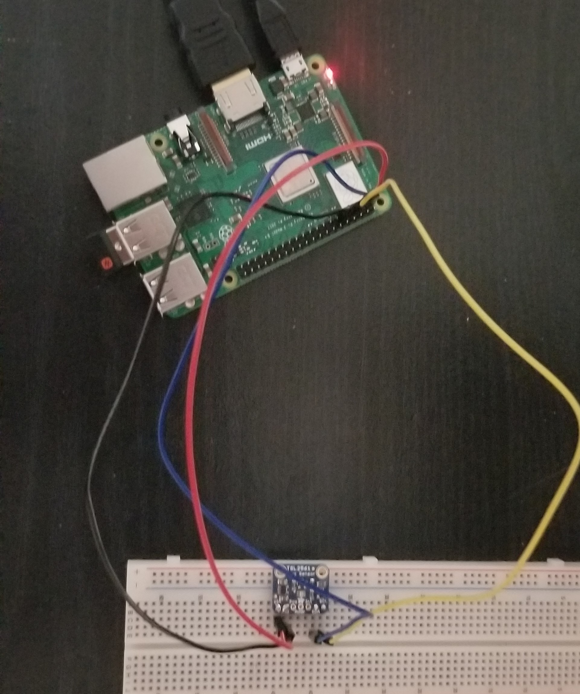
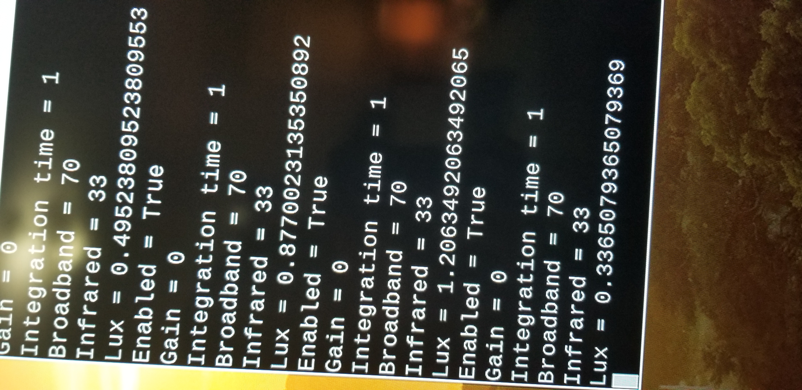
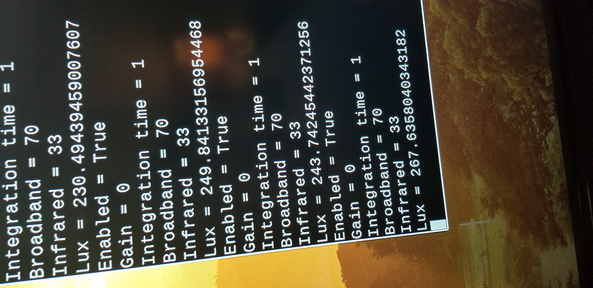
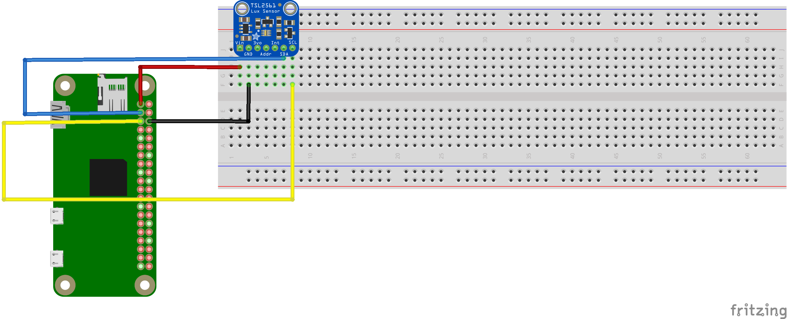
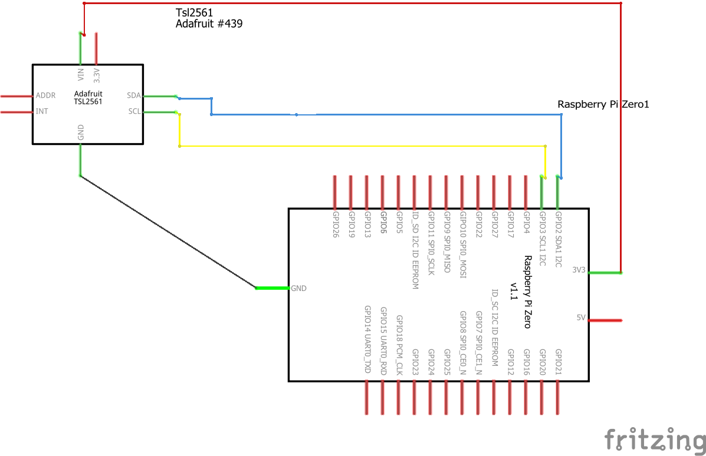
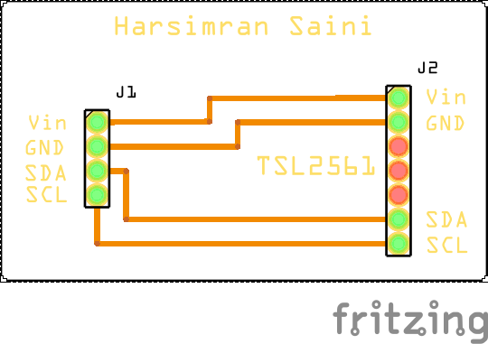
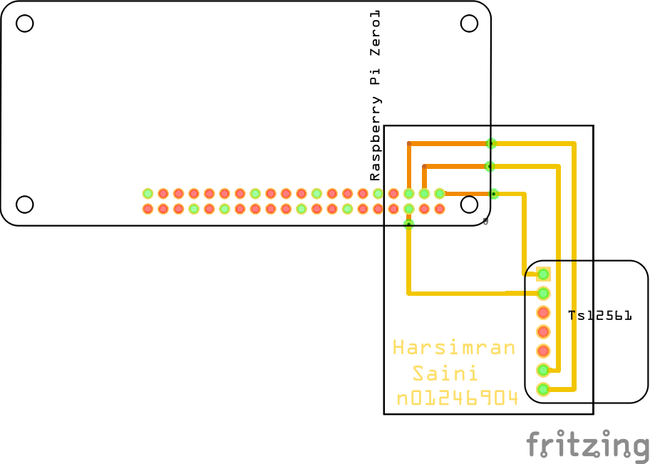

<html>
	<head>
		<title>CENG 317 Blog</title>
	</head>
	<body>
		<h1>Blog for CENG 317 - Lumi Monitor</h1>
		<h3>Week 11 (Nov 12th 2019)</h3>
		
This week was to power up our PCBs with a remote desktop connection which was a success!!

		
Everything is on track and now I am looking forward for next week which is the enclosure.

		<h3>Week 10 (Nov 5th 2019)</h3>
		
This week I gave my demo in class. I showed the professor the connection of my PCB which had no short. Also I had my remote desktop connection setup. For my remote desktop connection I had  to get myself a USB to Ethernet adapter and a Ethernet cable which has been updated in the <a href = "https://github.com/simransaini1999/Lumi-Monitor/blob/master/Documentation/Budget.xlsx">budget</a>. I am on track in the terms of the project working and finacially.

		<h3>Week 9 (Oct 29th 2019)</h3> 
		
This week when I gave my demo in class, I had to give it on a raspberry Pi 3. When I came home and tried run the code on my Raspberry Pi zero, The Raspberry Pi Zero crashed did not turn back on. I tried alot to search the meaning of this and everywhere it told me that my raspberry Pi Zero had died. So to resolve this issue I decided to order a raspberry Pi 3 this time, and it came in the second day. I have made an update to my <a href = "https://github.com/simransaini1999/Lumi-Monitor/blob/master/Documentation/Budget.xlsx">budget</a> and now back on track with my project in terms of the project working as well as finacially.
 
		
Uploaded the sample code from learn.adafruit.com for running my TSL2561 can be found <a href = "https://github.com/simransaini1999/Lumi-Monitor/blob/master/Software/TSL2561.py">here.</a> I had to make an edit to the code from adafruit inorder to print the output repeatedly because in my demo in class the output was only printing once.

		
		
This is my Light sensor when it is covered

		
		
This is my Light sensor when light is shined on it

		
		<h3>Week 8 (Reading Week)</h3>
		
In the reading week I loaded my OS/Bootloader and have it up and running. Also I made a trip to the protype lab to get my designed PCB.

		
		
This is my PCB

		
		
		<h3>Week 7 (Oct 15th 2019)</h3>
		
My Bread Board: 

		
		
My Sechmetic: 

		
		
My PCB: 

		
This is the PCB design I will be giving to the technologist for printing.

		
		
This PCB design is the one I created with the Raspberry pi and the TSL2561 sensor

		
		<h3>Week 6 (Oct 8th 2019)</h3>
		
This week I brought my acqusitions, a raspberry pi zero,LEDs, and my luminosity sensor(TSL2661) in and had presented them infront of the professor. Also after presenting them I also went to the J231 to get myself a socket for my PCB.

		
		<h3>Week 5 (Oct 1st 2019)</h3>
		
The proof of <a href = "https://github.com/simransaini1999/Lumi-Monitor/tree/master/Images/Proof%20of%20order"> Purchace </a> has been uploaded

		<h3>Week 4 (Sept 24th 2019)</h3>
		
This is the <a href = "https://github.com/simransaini1999/Lumi-Monitor/blob/master/Documentation/Budget.xlsx">budget</a> for my LumiMonitor Project, the other components will be bought by my partners. 

		<h3>Week 3 (Sept 17th 2019)</h3>
		
Handed in the <a href = "https://github.com/simransaini1999/Lumi-Monitor/blob/master/Documentation/Schedule.pdf">Schedule</a>

		<h3>Week 2 (Sept 10th 2019)</h3>
		
I handed in the <a href ="https://github.com/simransaini1999/Lumi-Monitor/blob/master/Documentation/ProjectProposalStudentNameRev03.pdf"> Proposal </a> today

		<h3>Week 1 (Sept 3rd 2019)</h3>
		
I created a <a href = "https://github.com/simransaini1999/Lumi-Monitor"> repository </a> for my Capstone project, Lumi Monitor

	</body>
</html>
		
